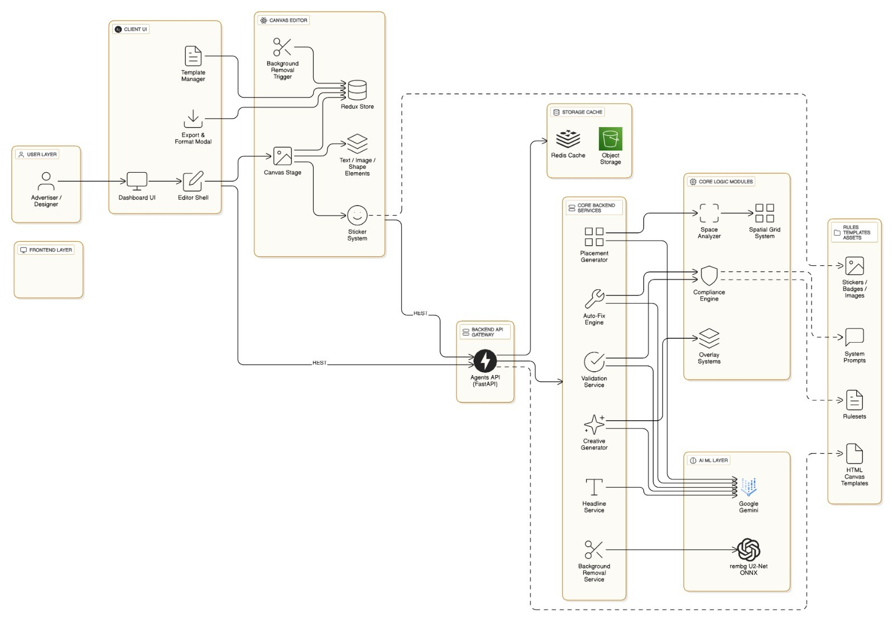

# ReTexture - AI Powered Retail Media Compliance Platform

**The Problem**

Tesco's retail media business faces a critical bottleneck: every creative submission requires manual validation against 40+ brand guidelines.
 
As supplier interest grows, the compliance team becomes overwhelmed, delaying campaign launches and losing ad revenue. 

Suppliers use editing tools without understanding Tesco specific rules.
Missing Drinkaware disclaimers on alcohol ads or wrong accessibility
contrast ratios expose Tesco to legal and brand integrity issues

Many abandon creative projects mid-process due to complexity, representing lost revenue and wasted platform investment.

**The Solution**

ReTexture is a generative AI-powered creative builder with real-time compliance enforcement. Suppliers design retail media directly in a browser-based canvas editor while an intelligent backend validates every element against Tesco's legal and brand guidelines. Instead of submitting designs for review and waiting days for feedback, creators receive instant violation alerts with one-click auto-fix capabilities.

**How It Works**

The system splits into two architectures: a lightning-fast offline-first frontend and a stateless intelligence backend.

The **frontend** runs entirely in the browser using Fabric.js, turning the canvas into a structured document of objects rather than pixels. Every drag, resize, and color change happens client-side with zero latency. Canvas state serializes to JSON with semantic metadata. 
Objects are tagged as `isTescoTag`, `isLogo`, or `customId`, enabling the backend to reason about design intent, not just visual appearance.

The **backend** (FastAPI + Gemini AI) exists only for authority and intelligence. When users click "Validate," the canvas JSON is sent to a compliance engine that parses objects into a 3x3 spatial grid, calculates region density, and runs 20+ deterministic rules: safe zone geometry, WCAG contrast ratios, font size thresholds, and blocked keyword detection. Violations return with `autoFixable` flags.

AI integration follows a critical principle: **Agent proposes, geometry decides**. When generating headlines, placements, or image variations, the LLM suggests creative options, but final validation runs through explicit Python math. 
Contrast ratios are calculated geometrically, not estimated. Placement candidates are generated by analyzing free space using spatial partitioning, then scoring 100+ options against multi-dimensional constraints. The LLM refines aesthetics on pre-filtered valid positions—preventing hallucinations from causing legal violations.

**Key Features**

- **Real-time compliance validation** with auto-fix using iterative Gemini refinement (up to 3 retry attempts)
- **AI-assisted content generation**: headlines, subheadings, product packshot variations with mandatory compliance prompts
- **Dual-path background removal**: client-side browser ML for speed, server-side ONNX for quality
- **Intelligent placement system**: spatial grid analysis generates candidates in viable free regions only
- **Multi-format export**: format-aware safe zones adapt creatives to 9:16, 1:1, and other retail placements
- **Pre-validated templates and stickers**: drag-and-drop compliant elements (Tesco badges, value tiles, logos)

**Impact**

ReTexture democratizes retail media creation for SMBs while eliminating compliance bottlenecks. Suppliers go from concept to compliant creative in minutes instead of days. Tesco reduces legal risk, accelerates campaign launches, and unlocks ad revenue previously lost to abandoned projects. The platform transforms compliance from a blocker into an invisible guardrail—creativity flows freely within brand-safe boundaries.

---


## Architecture Diagram



---

## 🛠️ Tech Stack

### Frontend
- **Next.js** - React framework with SSR/SSG
- **Fabric.js** - Canvas object model and manipulation
- **TypeScript** - Type safety
- **Zustand** - Global state management
- **TanStack Query** - Server state and caching
- **Tailwind CSS** - Styling
- **Shadcn UI** - Component library
- **Bun** - Package manager/runtime

### Backend
- **FastAPI** - Python async web framework
- **Uvicorn** - ASGI server
- **Google Gemini 2.5 Flash** - AI generation and validation (via Vertex AI)
- **rembg** - Background removal
- **ONNX Runtime** - Neural network inference
- **Pillow (PIL)** - Image processing
- **Pydantic** - Request/response validation
- **LangChain** - LLM orchestration for validation agents

---

## 🔧 Setup & Installation

### Prerequisites
- **Node.js 18+** and **Bun** (for frontend)
- **Python 3.11+** (for backend)
- **Google Cloud Project** with Vertex AI enabled
- **Google API Key** (for Gemini)

### 1. Clone Repository
```bash
git clone <repository-url>
cd Tesco
```

### 2. Backend Setup (Agents)

```bash
cd Agents

# Create virtual environment
python -m venv venv
venv\Scripts\activate  # Windows
# source venv/bin/activate  # macOS/Linux

# Install dependencies
pip install -r requirements.txt
# OR using pyproject.toml
pip install -e .

# Create .env file
cp .env.example .env
```

**Configure `.env` in `Agents/` folder:**
```env
GOOGLE_API_KEY=your_google_api_key_here
GCP_PROJECT_ID=your-gcp-project-id
GCP_LOCATION=us-central1
GEMINI_MODEL_ID=gemini-2.5-flash-image
SKIP_VALIDATION_AGENT=false
```

**Run Backend:**
```bash
uvicorn app.main:app --reload --port 8001
```

Backend runs at `http://localhost:8001`

### 3. Frontend Setup (Client)

```bash
cd Client

# Install dependencies
bun install

# Create .env.local file
cp .env.example .env.local
```

**Configure `.env.local` in `Client/` folder:**
```env
NEXT_PUBLIC_API_URL=http://localhost:8001
GOOGLE_API_KEY=your_google_api_key_here
```

**Run Frontend:**
```bash
bun dev
```

Frontend runs at `http://localhost:3000`

---

## 🎯 Usage

### Creating a Compliant Design

1. **Open Editor** - Navigate to `http://localhost:3000/editor`
2. **Choose Template** - Select from pre-validated templates (Car Sale, Flash Sale, Travel)
3. **Add Elements**:
   - Upload product images (with optional background removal)
   - Generate AI headlines/subheadings
   - Add Tesco stickers/badges from library
   - Place logos and value tiles
4. **Validate Design** - Click "Compliance" tab and run validation
5. **Auto-Fix Violations** - Click "Auto-Fix" on any violations
6. **Export** - Download in multiple formats (PNG, JPG, SVG, JSON)

### AI Features

**Background Removal:**
- Upload image → Click "Remove BG" → Get transparent PNG
- Works offline (client-side ML) or server-side for better quality

**Headline Generation:**
- Enter product concept → Get 3 AI-generated compliant headlines
- Auto-validated against blocked keywords

**Image Variations:**
- Upload packshot → Select style (Studio/Lifestyle/Creative) → Get 3 variations
- Backgrounds designed with safe zones for text overlay

**Smart Placement:**
- Add element → System suggests optimal position avoiding collisions
- 100+ candidates ranked by visual hierarchy and alignment

---

## 🔗 Integration Details

### Browser Canvas Editor (Client)
Maintains complete design state using Fabric.js object model with zero server dependency for interactive editing. Serializes canvas to JSON with custom metadata (`isTescoTag`, `isLogo`, `customId`) for backend semantic analysis. Triggers server calls only for intelligence operations (validation, AI generation, compliance fixes).

### Compliance Validation Engine (Agents Backend)
Receives base64-encoded Fabric.js JSON via `/validate` endpoint. Parses canvas into spatial grid structure, runs 20+ deterministic rules (safe zones, contrast, font sizes, blocked keywords). Returns structured violations with `autoFixable` flags and element-specific repair suggestions.

### AI Auto-Fix Pipeline
Accepts HTML/CSS snapshots with violation list via `/validate/auto-fix`. Strips base64 images, sends cleaned markup to Gemini with compliance prompt, validates structured JSON output. Iterates up to 3 times with corrective feedback if malformed HTML detected, restores images, returns patched code.

### Intelligent Placement System
Builds 3x3 spatial grid from canvas objects, calculates region density, identifies free space zones. Generates 100+ placement candidates with multi-constraint scoring (collision avoidance, hierarchy, alignment). Returns top-ranked position with geometric reasoning rather than raw LLM coordinate generation.

### Generative Content Services
Background removal: Dual-path via `/remove-bg` (server rembg+ONNX) or client-side browser ML. Image variations: `/generate/variations` sends product + concept to Gemini with compliance-enforced prompts. Headline generation: `/headlines/generate` creates 3 stylistic options validated against blocked keyword lists.

### State Management Layer (Frontend)
TanStack Query caches validation results, AI responses, and asset metadata with automatic invalidation. Zustand manages editor modes (tools, panels, active sidebar) independently from canvas state. React local state handles transient UI (sliders, inputs) without polluting global stores.

### Asset & Template System
Pre-validated stickers (`/stickers/available-at-tesco.png`) loaded with semantic flags (`isTescoTag: true`). JSON templates (`/public/car_sale.json`, `/public/flash_sale.json`) provide compliant starting layouts. Logo/badge overlay service composites mandatory elements programmatically with positioning constraints.

### Export & Multi-Format Pipeline
Canvas serialization respects format-aware safe zones (9:16 vs 1:1 aspect ratios). Export functions (`savePng`, `saveJpg`, `saveSvg`, `saveJson`) render workspace region only, excluding editor UI. Format constraints automatically adjust clearance zones and packshot gap requirements per retail placement type.


---

## 📝 License

MIT License - see [LICENSE](LICENSE) file for details.


## 👥 Contributors

Built for the Tesco Retail Media InnovAItion Jam 2025-26, by:

- **Ashish K. Choudhary** - [@ImAshishChoudhary](https://github.com/ImAshishChoudhary)
- **Himanshu Gupta** - [@himax12](https://github.com/himax12)
- **Pratham Gupta** - [@PrathamGupta06](https://github.com/PrathamGupta06)
- **Arpan Taneja** - [@arpan-lol](https://github.com/arpan-lol)

